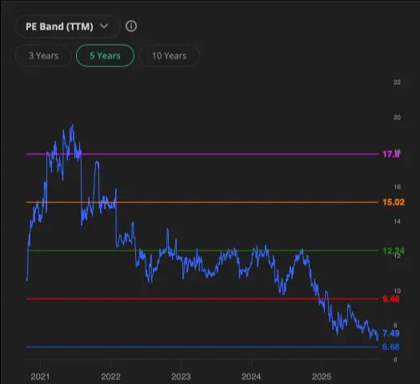
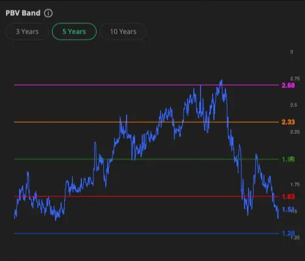

<strong>[Quick Update: BMRI]
</strong>
Bank Mandiri mencatat <strong>laba bersih Rp24,5 triliun (-7,9% YoY)</strong> pada 1H25, atau baru 43–44% dari target dan <strong>di bawah ekspektasi pasar</strong>. Laba bersih tertekan karena <strong>kenaikan beban operasional sebesar 25%</strong> secara YoY.

 <strong>Highlights</strong>

- <strong>Net profit:</strong> Rp11,3 triliun di Q2 2025 (-15% QoQ, -19% YoY). 1H 2025 Rp 24.5T (-7.89% Yoy)

- <strong>NIM:</strong> 4,92%, turun dari 5.09% pada 2024. Turun karena kenaikan Cost of fund

- <strong>CIR:</strong> melonjak ke <strong>48%</strong> akibat *one-off adjustment*

- <strong>Kredit tumbuh 11% YoY</strong> ke Rp1.701 triliun yang didorong oleh segmen korporasi (+36%) dan komersial (+24%). Loan terbesar BMRI adalah ke segmen FMCG, CPO, transportasi dan konstruksi.

- <strong>CASA ratio</strong> masih tinggi di <strong>74%</strong>, meski sedikit turun dari 75% tahun lalu

- <strong>Asset quality:</strong> NPL 1,2%, LaR 6,9%, coverage 246%, CoC hanya 0,8–0,9%

 <strong>One-Off Adjustment</strong>

Beban besar di Juni 2025 berasal dari <strong>penyesuaian pengakuan biaya</strong>. Btw, management ga merinci soal ini, tapi dari sini kita tahu bahwa kenaikan beban ini sifatnya sementara saja. Manajemen juga menargetkan <strong>CIR normal kembali ke 40–42% di 2026</strong>.

<strong> Valuasi</strong>

- Valuasi BMRI berada pada posisi all time low dalam 5 tahun terakhir. Sebagai catatan, BMRI pernah di valuasi PE 6, PBV 0.9 saat covid. Sekarang di PE 7 dan PBV 1.5

- Penurunan valuasi BMRI menurut kita karena turunnya kinerja BMRI di tahun ini. Mostly juga karena high base di tahun lalu, ketatnya likuiditas dan peningkatan suku bunga yang menekan profit BMRI.

- Selain itu, asing yang terus menerus net sell menekan harga terus turun. Asing yang terus net sell kelihatannya karena perubahan bobot saham di MSCI.

- BPJS Ketenagakerjaan di sisi lain mulai menambah investasi mereka di saham. Dana kelolaan BPJS Ketenagakerjaan &gt;Rp 800 T dan bobot saham akan ditingkatkan ke 10%. Hal ini mengonfirmasi rencana BPJS di bulan April 2025 yang akan menaikkan porsi ke 20%. (source: <a class="anchor-url" href="https://www.idnfinancials.com/id/news/53776/bpjs-tk-akan-gandakan-porsi-di-saham-potensi-inflow-rp27-triliun" target="_blank" rel="noopener noreferrer">https://www.idnfinancials.com/id/news/53776/bpjs-tk-akan-gandakan-porsi-di-saham-potensi-inflow-rp27-triliun</a>

- Dengan adanya tambahan inflow dari BPJS, bisa memberikan tambahan inflow ke BMRI dan big banks lainnya. Sebagai konteks, outflow asing dari BMRI sebesar ~Rp 20 T secara YTD.

 <strong>POV Midas</strong>

Secara bisnis, big banks generally cukup oke. Tekanan kinerja juga menurut kita sementara, tidak struktural. Sambil menunggu BMRI kembali ke harga wajar, kita masih bisa dapat dividen 8%. Kalau BMRI bisa tumbuh 7% setelah kondisinya membaik, return 15% per tahun. Not bad.

Kita tetap watch BMRI, tapi apakah artinya akan perform dalam waktu pendek? Tidak tahu. Tapi kalau Anda punya time horizon investasi 3 tahun atau lebih (tanyakan ke diri sendiri, sanggup nunggu ga?), harga BMRI sangat menarik.

Harga BMRI hari ini seperti harganya di tahun 2018. Padahal laba 6M 2025 saja sudah sama seperti laba setahun penuh di tahun 2018. CASA hampir 2x lipat, loan 2x lipat. Apakah menurut Anda Mr Market rasional?

—
