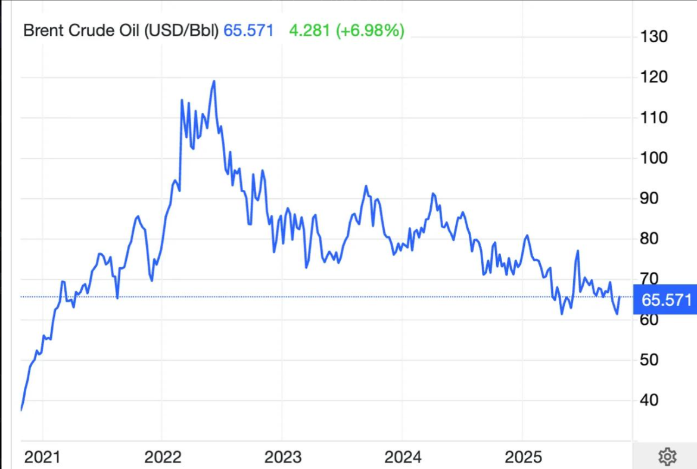
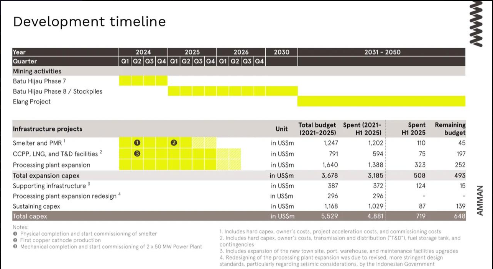
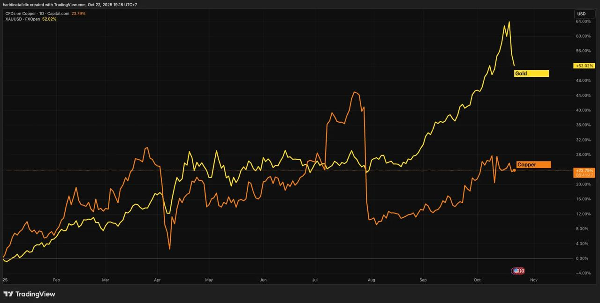
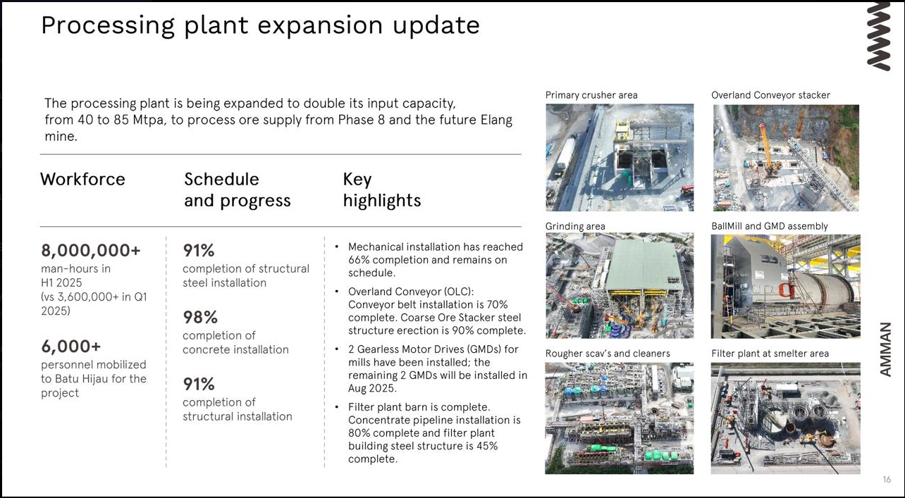

<strong>[Quick Review: MEDC]</strong>

MEDC adalah produsen oil &amp; gas dan juga memiliki 21% saham AMMN, tambang emas terbesar ke-2 di Indonesia setelah Freeport.

Juni kemarin, MEDC baru menuntaskan akuisisi 24% hak partisipasi dari 46% jadi 70%.

Lalu mereka juga berencana terus buyback saham hingga triliunan

Bagi member lama, Anda bisa baca lebih detail soal bisnis MEDC di analisa saham. Kita pernah punya kenangan manis di MEDC tahun 2022, bedah bisnisnya juga 3 tahun lalu, tapi masih relevan kok secara bisnis.

<strong>Business Overview</strong>

Secara produksi roughly 70-80% gas, 20-30% oil. Harga jual oil mengikuti market (acuannya Brent) jadi bisa fluktuasi. Harga gas, itu 50% sudah fixed di $5.8 - $5.9/mmbtu, sisanya 20% itu ngikut harga Brent.

Jadi kasarnya, roughly 50% harga jual fixed, 50% harga jual ngikut brent. Nah gimana dengan harga brent?

Harga Brent cukup rendah dalam beberapa tahun terakhir. Selain karena pertumbuhan ekonomi global yang melambat, US juga terus menerus menjual cadangan minyaknya (strategic petroleum reserves). Hal ini membuat supply minyak banjir di market dan harga cukup turun).

Namun, perkembangan terakhir, US mulai akan kembali mengisi SPR nya.

Furter reference: <a class="anchor-url" href="http://bloomberg.com/news/articles/2025-10-21/us-to-buy-1-million-barrels-for-strategic-petroleum-reserve" target="_blank" rel="noopener noreferrer">http://bloomberg.com/news/articles/2025-10-21/us-to-buy-1-million-barrels-for-strategic-petroleum-reserve</a>

Oil di harga &lt;$70 agak kurang sustain, karena cost produksi dan eksplorasi bisa mencapai $70 di beberapa tempat.

So, kalo harga oil naik, MEDC juga akan terkena dampak karena harga acuan mereka ngikut Brent.

<strong>AMMN ga bisa jualan</strong>

Per 2025, AMMN mengalami kerugian besar. Hal ini karena mereka ga diperbolehkan jualan concentrate dan harus diolah dulu gold &amp; copper nya.

Nah di Q2 kemarin mereka uda berhasil ngolah copper nya jadi cathode dan uda bisa jualan. Lalu di bulan Juli (Q3) mereka uda berhasil commissioning pabrik emasnya.

Total kapasitasnya 220 ribu ton (440 Mlbs) copper dan 579ribu oz emas. Setahu saya, smelter copper cuma ada 2 di Indonesia, yaitu milik Freeport dan milik AMMN.

Berikut development timelinenya AMMN.

Harga jual gold di Q3 dan memasuki Q4 ini juga terlihat naik. So ketika smelter gold &amp; coppernya jika sudah bisa jualan, tentu akan kasih dampak yang positif bagi AMMN dan juga bagi MEDC.

<strong>Berapa laba MEDC Nanti?</strong>

Kita pake asumsi harga brent di kisaran $70 - 80 saja, karena ini harga yang make sense bagi produsen. Ga kerendahan, ga ketinggian. Kita tahu MEDC akuisisi tambahan 24% di PSC Corridor, artinya bagian mereka juga nambah roughly 50% kan (46% jadi 70% naik roughly 50%).

Kita tinggal cek saja berapa laba mereka ketika oil di $70 - 80, yaitu tahun lalu. Laba sebelum pajak $671 juta, kita kurangin laba dari AMMN $113 juta saat itu = $558 juta.

Tahun 2024 produksinya 152 mboepd, per 1H 2025 setelah akuisisi tambahan 24% Corridor, produksi bisa jadi 155 - 160, naik cuma 5%. Yah ini karena by nature, year by year produksi di sumur oil &amp; gas memang akan turun.

Intinya kita bisa kira - kira, harusnya laba sebelum pajak bisa lah tetap $558 juta (Rp 9.4T) dan harusnya sih bisa lebih dari Rp 10 T.

<strong>Lalu untuk AMMN..</strong>
Let say produksi copper &amp; gold bisa 80% capacity.

Smelter AMMN bisa produksi 220 ribu ton Copper Cathode, 80% dari itu 176 ribu ton.

Kaliin harga jual $10ribu/ton = $1.76 miliar.

Kapasitas Gold 579kOz x 80% x ASP $3500/oz (estimasi aja) = $1.62 miliar

Total sales $3.38 miliar kan. Buletin $3.5 miliar deh, Rp 58 T.

EBITDA margin (istilah lainnya cash margin, yaitu ASP - cash cost) di Q2 2025 mencapai 71%. Di Q2 kita tahu smelternya sudah jalan kan. Artinya komponen cost besar itu kemungkinan dari depresiasi dan amortisasi, serta beban bunga saja. Kira2 EBITDA Rp 41 T.

Beban bunga AMMN sekitar 6% dari debt. Debt AMMN itu sekitar $6 bio, jadi beban bunga $360 jt atau Rp 6T.

Beban depresiasi dari aset tetap dibagi aja masa manfaat aset tersebut. Kalo dilihat dari LK, beban depresiasi roughly $200 jt per tahun, ya taroklah kasarnya jadi $250 juta. Rp 4.2T.

Jadi laba AMMN = (Rp 41 T - Rp 6 T - 4.2 T) - 22% tax = Rp 24 T. Bagian MEDC 21% = Rp 4 T.

Dari hitung - hitungan kasar ini, <strong>keliatannya laba MEDC bisa melebihi laba 2022 nya</strong> yang di kisaran Rp 8 T atau setidaknya menyamai.

Ini belum termasuk ekspansi ini yang uda mau selesai, efeknya di Q1 2026

<strong>Valuasi</strong>

Let say asumsi PE 8 x Rp 8 T (angka cantik banget haha) = Rp 64 T seharusnya harga wajar MEDC.

Market cap per tulisan ini dibuat Rp 35 T. Ada margin of safety yang lumayan 45%. Ya taroklah perkiraan saya salah dan meleset jadi Rp 55 T. Maybe ada hal - hal yang tidak saya duga, oil turun lagi, smelternya telat, etc. Diskonnya masih lumayan.

Kalo ternyata labanya lebih tinggi, ya bagus.

<strong>Risk</strong>

Don’t forget about risk, penting ini:

- MEDC dan AMMN, keduanya punya debt cukup tinggi. Tapi keduanya punya cash flow yang lebih dari cukup buat bayar debt.
- Oil, Copper &amp; Gold turun. Kalo ketiga komoditas ini turun, jelas ngefek banget ke harga jual dan laba MEDC/AMMN. Tapi ya kalo disuruh prediksi, harusnya oil yang naik, gantian dong masa gold mulu.

Kalo tertarik, silahkan dalami dan adjust your risk accordingly. Jangan juga masuk kegedean, buat apa hold tapi deg - degan, ga bisa makan, ga bisa tidur.

Jangan all in, apalagi masih pemula. Jangan juga ngikutin saya. Ingat mantra ini: Orang yang ngikut aja, ga mungkin cuan besar. Orang yang cuan besar, ga mungkin cuma ikut - ikutan.

Have a great day! Semoga ulasan ini bermanfaat.
